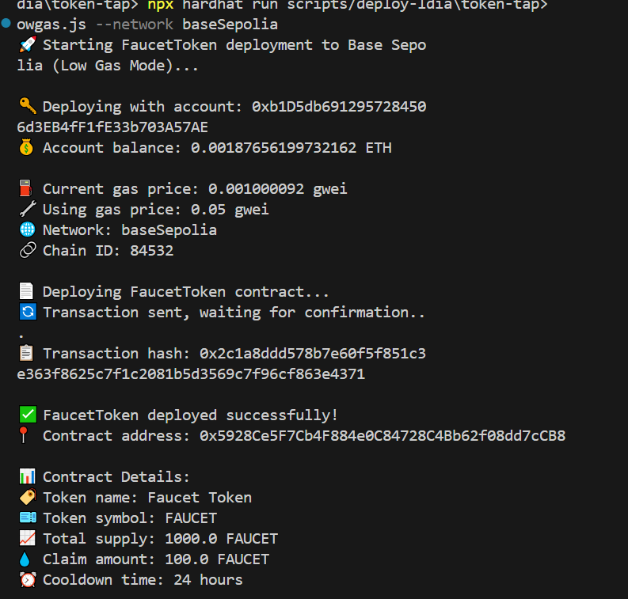
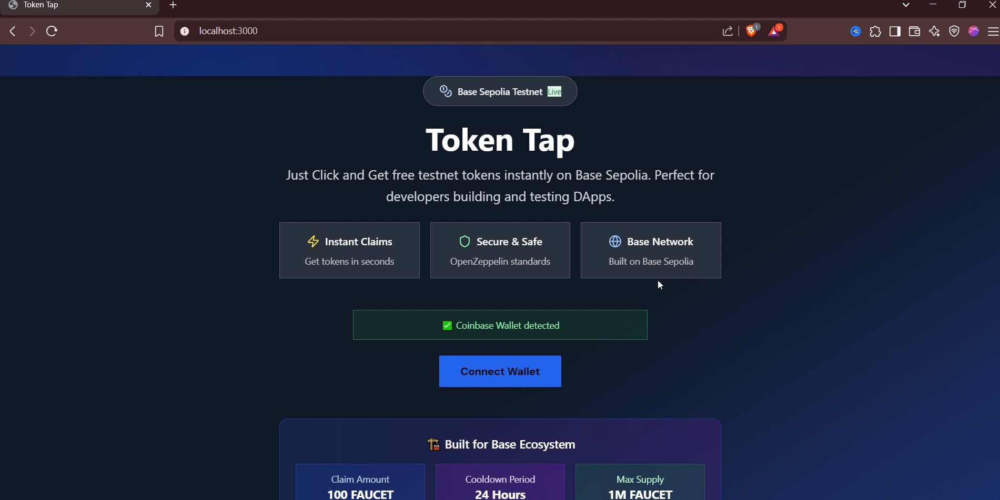
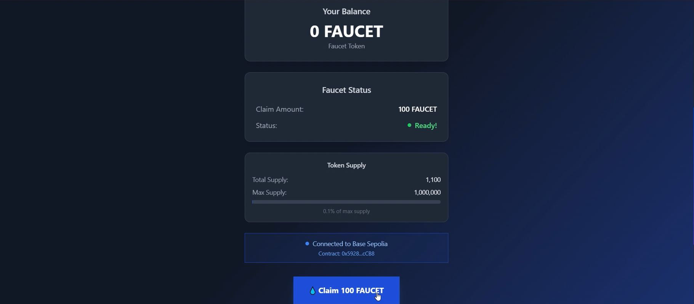
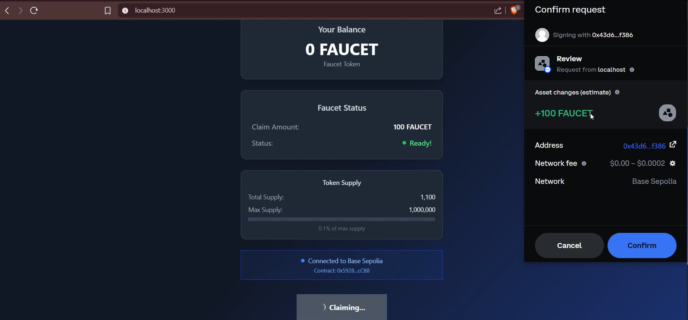
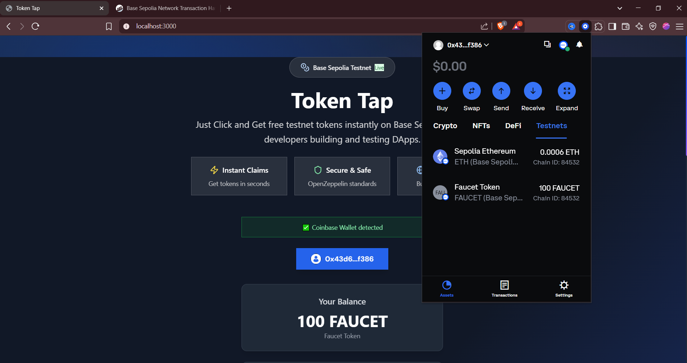

# Token Tap 🚰

**One click and get tokens in your wallet**

A streamlined Web3 application built on Base that enables users to claim tokens with a single click directly to their wallet.

## 🌟 Features

- **One-Click Token Claims**: Simplified token distribution process
- **Base Network Integration**: Built on Coinbase's Base L2 for fast and cheap transactions
- **Wallet Connection**: Seamless integration with popular Web3 wallets
- **User-Friendly Interface**: Clean and intuitive design for all users
- **Gas Optimized**: Efficient smart contracts to minimize transaction costs

## 🚀 Getting Started

### Prerequisites

- Web3 wallet (MetaMask, Coinbase Wallet, etc.)
- Base network added to your wallet
- Some ETH on Base for gas fees

## 🖼️ Screenshots

### Smart Contract Deployment


### dApp Overview


### Claim Faucet



### Success



### Transaction on BaseScan
![Basescan activity] (6-sepolia-basescan.png)

## 🔧 Technology Stack

- **Frontend**: Next.js
- **Blockchain**: Base (Ethereum L2)
- **Smart Contracts**: Solidity, Hardhat
- **Web3 Integration**: Mini-kit
- **Styling**: Tailwind CSS, Shadcn

## 📱 Usage

1. **Connect Wallet**: Click "Connect Wallet" and select your preferred wallet
2. **Switch to Base**: Ensure you're connected to the Base network
3. **Claim Tokens**: Click "Claim Tokens" to receive tokens instantly
4. **View Balance**: Check your wallet to see the received tokens

## 🌐 Links

- **Base Scan**: [Faucet Claim - Transaction Successful](https://sepolia.basescan.org/tx/0x6e1fd1400c235e13d413c1043be8f6217269a4eb2ac61e7985b7082336e03399)


### Installation

1. Clone the repository
```bash
git clone https://github.com/smilewithkhushi/token-tap.git
cd token-tap
```

2. Install dependencies
```bash
npm install
```

3. Set up environment variables
```bash
cp .env.example .env
# Add your configuration
```

4. Run the development server
```bash
npm run dev
```

## 🤝 Contributing

1. Fork the repository
2. Create your feature branch (`git checkout -b feature/AmazingFeature`)
3. Commit your changes (`git commit -m 'Add some AmazingFeature'`)
4. Push to the branch (`git push origin feature/AmazingFeature`)
5. Open a Pull Request

---

**Built with ❤️ on Base**